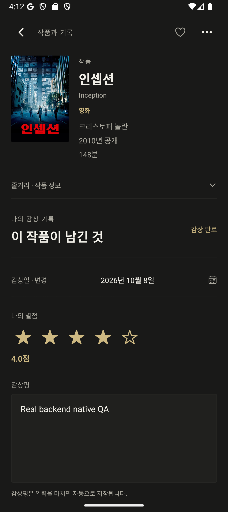
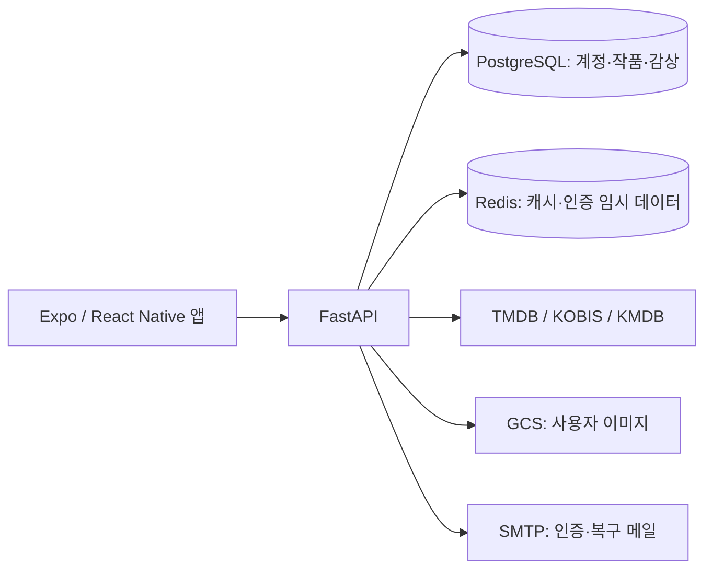

<p align="center">
  
</p>

<h1 align="center">CineEntry</h1>
<p align="center">영화와 시리즈를 보관하고, 감상 날짜·별점·리뷰를 남기는 개인 기록 앱</p>
<p align="center">
  <a href="#할-수-있는-일">기능</a> ·
  <a href="#시작하기">시작하기</a> ·
  <a href="frontend/README.md">앱 개발</a> ·
  <a href="backend/README.md">서버 설정</a> ·
  <a href="#현재-상태와-제한">현재 상태</a>
</p>

> **서비스 상태 · 2026-10-09**
> 기존 클라우드 이용이 만료되어 다른 인프라로 이전이 필요합니다. 운영 재배포는 보류 중입니다. 아래는 소스코드로 로컬 개발 환경을 실행하는 안내이며, 바로 이용할 수 있는 공개 서비스나 설치 파일 안내가 아닙니다.

## 할 수 있는 일

- **찾고 보관하기** — TMDB·KOBIS·KMDB에서 작품을 검색하고 보고 싶은 목록에 담습니다.
- **감상 기록하기** — 보고 싶음·감상 중·감상 완료 상태, 날짜, 별점과 리뷰를 관리합니다. 시리즈는 시즌·회차 진행 상황도 남깁니다.
- **묶어 보기** — 태그와 수동 컬렉션으로 정리하고, 조건에 맞는 자동 컬렉션을 동기화합니다.
- **돌아보기** — 최근 감상, 월별·장르별 통계, 관람 캘린더와 연간 목표를 확인합니다.

영화 재생이나 스트리밍을 제공하는 앱은 아닙니다. 기록은 API 서버에 저장되며, 오프라인 전용 앱이 아닙니다.

## 기록은 이렇게 남깁니다

1. **작품 검색**에서 제목을 찾고 출처에서 확인한 정보를 살펴봅니다.
2. **보관**하면 보고 싶은 작품으로 내 보관함에 추가됩니다.
3. 감상 후 **별점·감상평 기록**에서 완료 기록을 남깁니다. 이후 리뷰를 수정해도 기존 감상 날짜는 유지됩니다.
4. 컬렉션의 **작품 추가**에서 보관함의 작품을 고릅니다. 기록은 홈과 회고에서도 확인할 수 있습니다.

<p align="center">
  
</p>
<p align="center"><sub>실제 Android 에뮬레이터의 Expo Go 화면. 로컬 FastAPI·PostgreSQL에 저장한 테스트 기록이며 운영 계정 데이터가 아닙니다.</sub></p>

## 시작하기

현재는 개발 환경을 직접 구성해야 합니다. **Node.js 24, Python 3.12, Docker Compose v2**와 모바일 실행 환경을 준비하세요. Android는 SDK 55와 호환되는 Expo Go가 설치된 에뮬레이터를 사용할 수 있습니다.

```bash
git clone https://github.com/webstrdy00/CineEntry.git
cd CineEntry
```

이 문서의 기능·설정은 README가 포함된 체크아웃 기준입니다. 다른 브랜치의 안내와 환경 파일을 섞지 마세요.

| 순서 | 안내 | 완료 확인 |
| --- | --- | --- |
| 1 | [백엔드 설정 및 실행](backend/README.md#로컬-실행) | `/health` 응답과 `/docs` 접근 |
| 2 | [앱 환경변수 및 실행](frontend/README.md#로컬-실행) | 앱에서 로컬 API에 연결 |
| 3 | 회원가입 후 작품 검색·보관 | 보관함에 등록한 작품 표시 |

PostgreSQL·Redis는 로컬에서 실행합니다. 작품 검색에는 영화 API 키, 이메일 인증에는 SMTP, 이미지 업로드에는 접근 가능한 GCS 버킷과 자격이 필요합니다. 모든 키 없이 전체 기능을 사용할 수 있다는 뜻은 아닙니다. [기능별 설정 조건](backend/README.md#기능별-설정)을 확인하세요.

웹은 기본적으로 **모바일 OAuth 인증 브릿지 전용**입니다. `npm run web`만 실행해 전체 앱이 열리지 않는 것은 기본 정책이며, [전체 웹 앱 실행 조건](frontend/README.md#웹-실행)을 별도로 확인하세요.

## 구성



위 그림은 **현재 코드의 의존 관계**입니다. 이전할 클라우드나 새 운영 배치 구성을 확정한 그림이 아닙니다.

| 영역 | 기술 | 안내 |
| --- | --- | --- |
| 앱 | Expo SDK 55, React Native 0.83, TypeScript, React Navigation 7 | [frontend](frontend/README.md) |
| API | FastAPI, SQLAlchemy, Alembic | [backend](backend/README.md) |
| 데이터 | PostgreSQL 15, Redis 7 | [로컬 Compose](backend/docker-compose.yml) |
| 자동 검사 | GitHub Actions, pytest, Node.js test runner | [워크플로](.github/workflows/backend-deploy.yml) |

## 현재 상태와 제한

- **확인한 범위:** 2026-10-09 기준 백엔드 단위 테스트 242개, 별도 실제 DB 통합·동시성 테스트 9개, 프런트 테스트 57개가 통과했습니다. Android Expo Go에서 실제 로컬 백엔드 연결과 검색·보관·컬렉션·감상 저장을 확인했습니다. 재실행 방법은 각 개발 가이드에 있습니다.
- **확인하지 않은 범위:** 새 운영 환경, 실제 운영 OAuth 전체 흐름, 서명 APK/AAB 설치, iOS 런타임. 전체 플랫폼 export 성공은 설치·배포 성공을 의미하지 않습니다.
- **외부 서비스:** 현재 GCS 접근은 기존 프로젝트 결제 중단으로 차단된 상태입니다. 새 저장소/인프라 준비 전에는 이미지 기능을 정상 이용할 수 없습니다.
- **인증:** OAuth 트랜잭션은 서버 프로세스 메모리에 있습니다. 공유 저장소로 전환하기 전에는 worker/replica를 1개로 유지합니다.
- **데이터:** 외부 출처 작품 정보는 읽기 전용입니다. 개인 리뷰·날짜·별점·태그는 수정할 수 있습니다. 파일 삭제와 DB 변경은 하나의 원자적 트랜잭션이 아니며, 저장소 실패 시 참조를 유지하고 재시도를 요구합니다.
- **의존성:** 2026-10-09 감사에서 백엔드 알려진 취약점은 0건, npm 빌드 도구 전이 경로에는 33건이 남았습니다. 배포 전 재감사와 위험 검토가 필요합니다.

## 문제를 발견했다면

[Issues](https://github.com/webstrdy00/CineEntry/issues)에 실행 환경, 사용한 브랜치/커밋, 재현 순서와 예상·실제 결과를 남겨주세요. API 키, 인증 토큰, `.env`, 개인 기록이 포함된 로그는 공개하지 마세요.

라이선스 파일은 현재 저장소에 없습니다. 다른 참고 프로젝트의 라이선스가 이 저장소에도 적용되는 것으로 간주하지 마세요.
